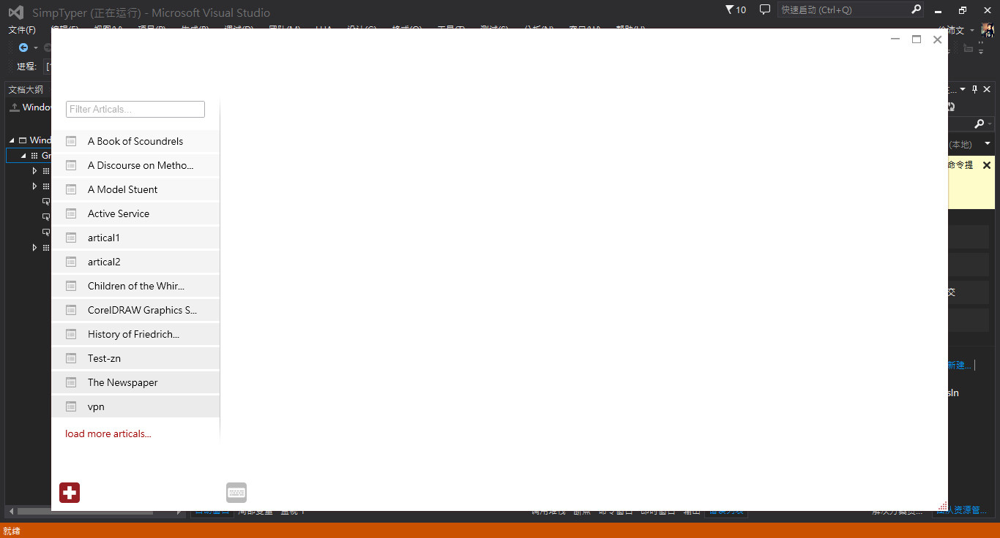
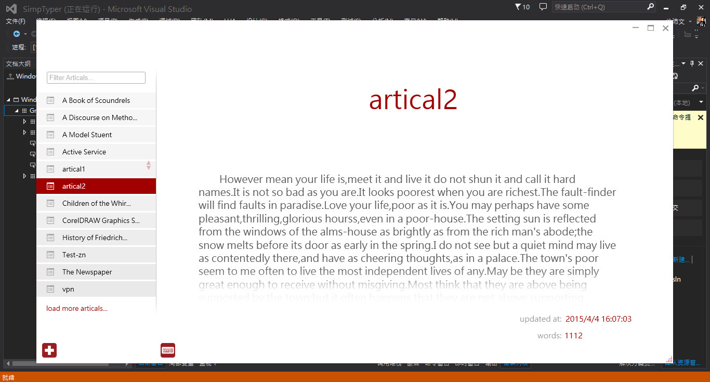
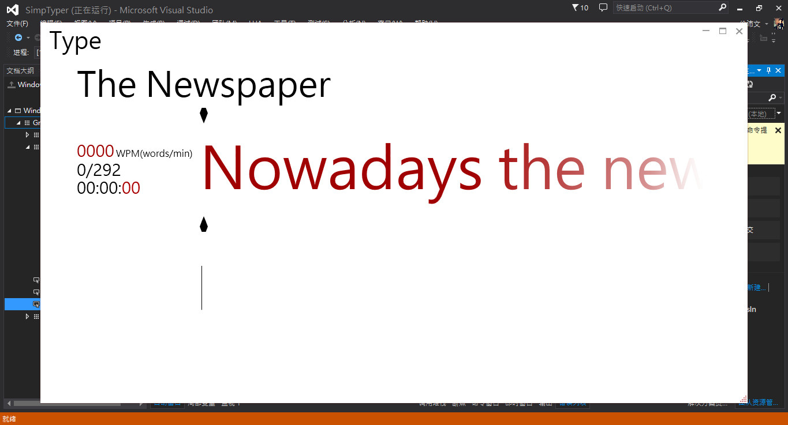
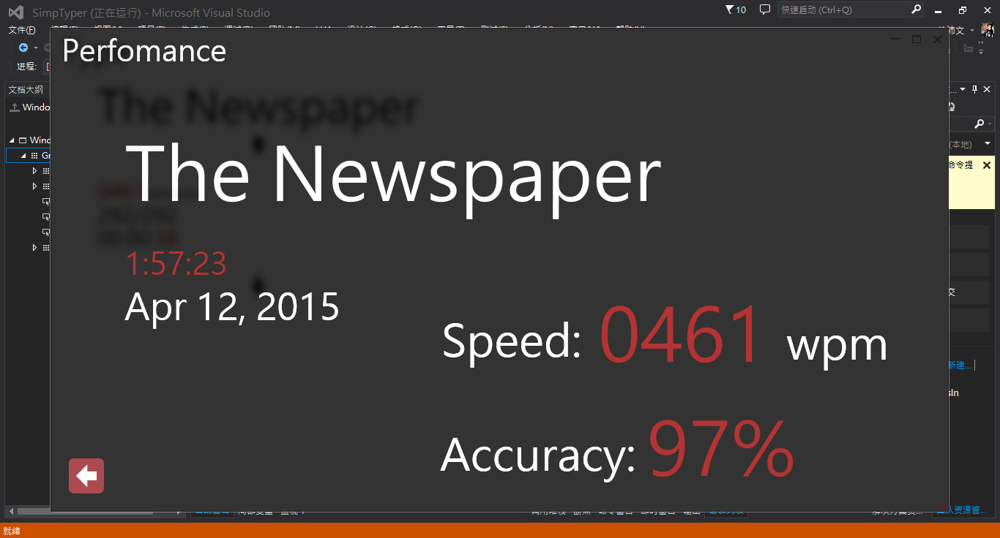

## SimpTyper

**SimpTyper** is a simple but interesting typer. This project has began on March,17 in 2015. :grin:

The project has began for almost one month, all the work brings me tired feelings. However, I got amazing experience in this project.

Ok, Let's see what I've done.

First, here is the main grid of the software.

What we can see in the left box is a list of artical what you have added in this typer. (All the file must be a format of .txt)

Then, when we move our mouse up the items shown on this list, we will have a preview of it. And after we choose it, we can look through the whole text.

Now Let's come to the second part: Type

Finally, When we finish typing, it will automatically show you your perfomance like below:

So, is that job done? The answer is absolutely not. I'll keep making it better with a heart of learning more technology of developing softwares.

### Attentions

The sort of your score is still not temporarily implemented.

### Download

Click [**here**](https://github.com/aleen42/SimpTyper/raw/master/SimpTyper.exe) to download **.exe** file and just install it.

### :yum: How to contribute

Have an idea? Found a bug? See [how to contribute](https://aleen42.gitbooks.io/personalwiki/content/contribution.html).

### :scroll: License

[MIT](https://aleen42.gitbooks.io/personalwiki/content/MIT.html) © aleen42
